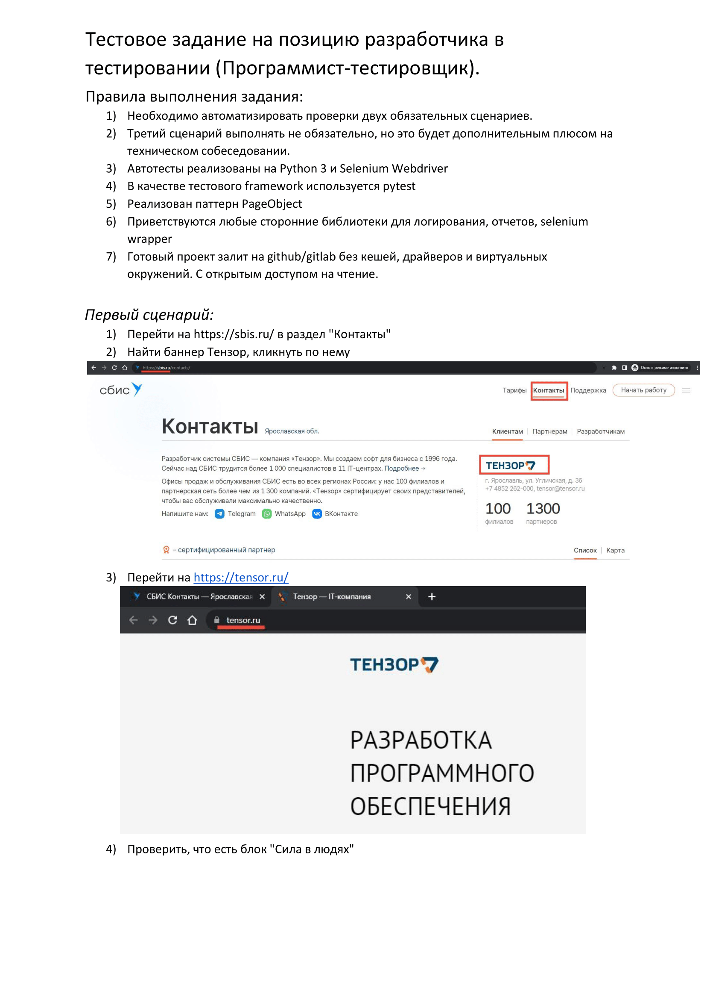
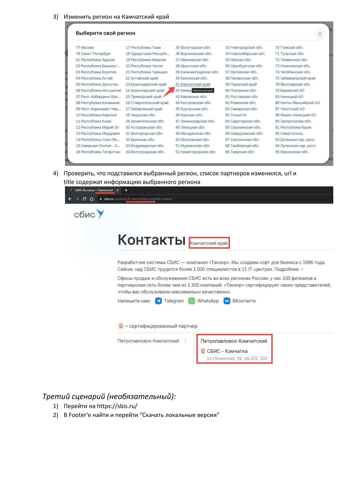
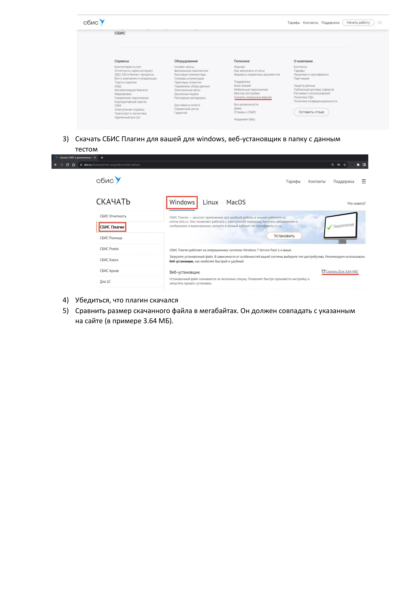

## Тестовое задание от компании 'Тэнзор' на автотестирование

ссылка
на задание: https://mail.google.com/mail/u/0?ui=2&ik=dd231a7fec&attid=0.1&permmsgid=msg-f:1804108718783301683&th=19097b5237438833&view=att&disp=inline

### Устновка, запуск:
1. Склонировать репозиторий
2. У вас должен быть установленн ChromeDriver, соответствующий вашей версии Chrome.

3. **_Для прохождения теста проверки местоположения **_вам нужно указать свой регион в файле .env!!!_** _**
Для этого: 
Замените город и область на свои(как они прописаны на сайте SBIS).
Сейчас установлены:
REGION=Нижегородская обл.
CITY=Нижний Новгород

4. Создать виртуальное окружение
5. Активировать виртуальное окружение
6. Установить зависимости ('pip install -r requirements.txt')
7. Запускаем тесты из корня директории командой 'pytest -s -v' 
